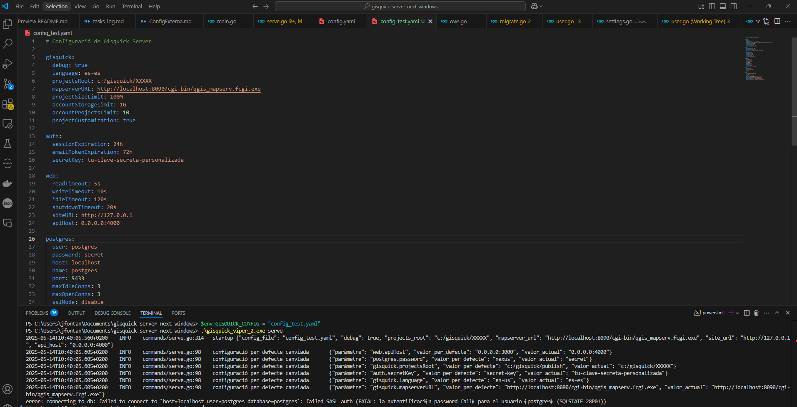

# Implementació de configuració externa per a QVistaWeb

## Què hem fet

Hem implementat la configuració externa per a QVistaWeb (adaptació de Gisquick per a Windows) utilitzant la biblioteca **Viper** de Go. Aquesta millora permet modificar els paràmetres de l'aplicació sense necessitat de recompilar el codi cada vegada que volem canviar un valor de configuració.

## Com funciona

1. **Biblioteca Viper**: Hem integrat aquesta potent biblioteca que gestiona configuracions en diferents formats (YAML, JSON, TOML) i permet múltiples fonts de configuració amb prioritats clares.

2. **Fitxer de configuració YAML**: S'ha creat un format estàndard de configuració en YAML que conté tots els paràmetres configurables de l'aplicació, organitzats en seccions lògiques.

3. **Variables d'entorn**: S'ha mantingut la possibilitat de sobreescriure qualsevol paràmetre utilitzant variables d'entorn amb el prefix `GISQUICK_`.

4. **Detecció de canvis**: S'ha implementat una funció `checkConfigChanges()` que detecta i mostra els paràmetres modificats respecte als valors per defecte.

## Evidències

La captura de pantalla mostra l'execució del servidor amb un fitxer de configuració de prova anomenat config_test.yaml. A la terminal podem veure:

Es pot observar:

- El fitxer de configuració carregat (`"config_file": "config_test.yaml"`)
- El servidor executant-se amb la versió de Viper (`.\gisquick_viper_2.exe serve`)
- Els paràmetres modificats respecte als valors per defecte, com:
  - `projectsRoot` canviat a `c:/gisquick/XXXXX`
  - `language` a `es-es`
  - `mapserverURL` a `http://localhost:8090/cgi-bin/qgis_mapserv.fcgi.exe`
  - `secretKey` a `tu-clave-secreta-personalizada`
  - `password` de postgres canviat a `secret`
  - `apiHost` canviat a `0.0.0.0:4000`

La terminal mostra clarament els missatges de log amb el text "configuració per defecte canviada" seguit del paràmetre, el valor per defecte i el valor actual, el que confirma que el sistema està funcionant correctament.

## Resum de millores

- Ara podem canviar la configuració sense recompilar l'aplicació
- Els canvis de configuració són més visibles i traçables
- Es poden tenir diferents fitxers de configuració per diferents entorns
- Es facilita el desplegament en producció
- Més flexibilitat per als administradors del sistema

Aquesta implementació completa el ticket IDB-2909 per a la inicialització de paràmetres de GisQuick Server.