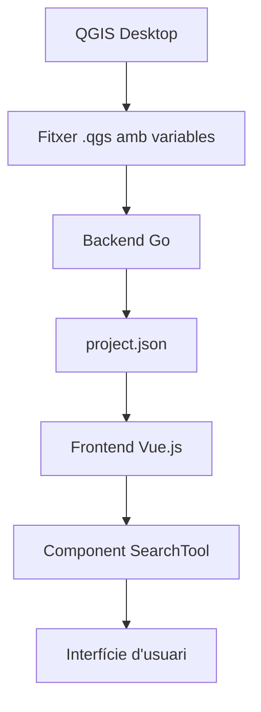
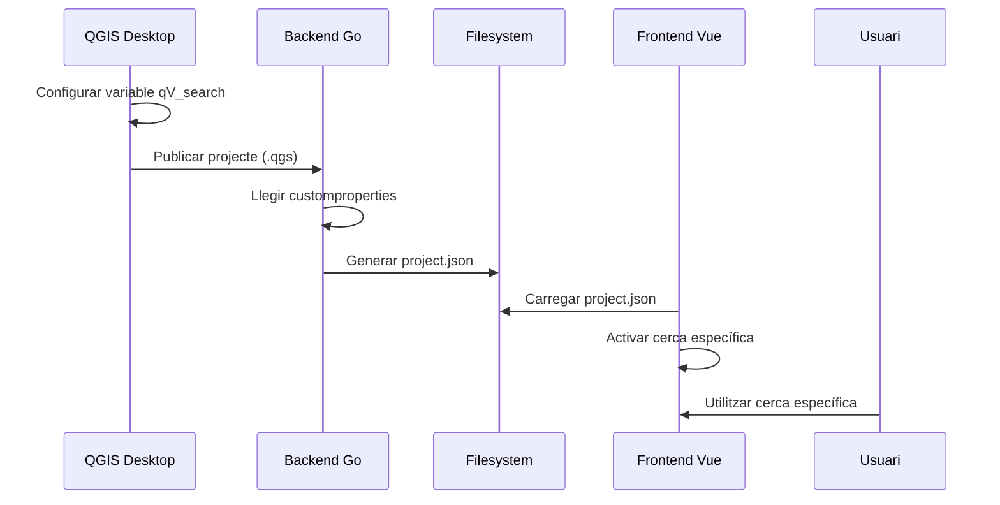
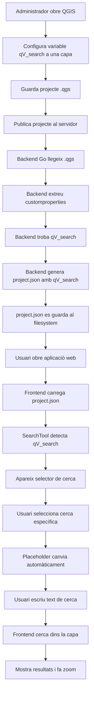

# Especificació Tècnica Completa - Sistema de Cerca Específica en Capes Vectorials

**Document:** Disseny Tècnic Complet - Sistema de Cerca Específica  
**Projecte:** Gisquick-QVista  
**Data:** 6 de juny de 2025  
**Versió:** 1.0

---

## 📋 Índex

1. Visió General del Sistema
2. Context i Problema a Resoldre
3. Arquitectura del Sistema
4. Implementació Backend
5. Implementació Frontend
6. Flux de Dades Complet
7. Casos d'Ús i Exemples
8. Pla d'Implementació
9. Testing i Validació
10. Criteris d'Acceptació

---

## 1. Visió General del Sistema

### 1.1 Què és la Cerca Específica?

La **cerca específica** permet als usuaris cercar directament dins dels camps de les capes vectorials del mapa, en lloc de només utilitzar el cercador genèric de Barcelona.

**Exemple pràctic:**
- **Abans:** Només es podia cercar "Carrer de Balmes, Barcelona"
- **Després:** Es pot cercar "PARC001" dins la capa de parcel·les o "Hospital Sant Joan" dins la capa d'equipaments

### 1.2 Components del Sistema



### 1.3 Responsabilitats per Component

| Component | Responsabilitat | Tecnologia |
|-----------|-----------------|------------|
| **QGIS Desktop** | Configurar variables de cerca per capa | QGIS |
| **Backend Go** | Llegir variables i generar project.json | Golang |
| **Frontend Vue** | Mostrar interfície i executar cerques | Vue.js |
| **SearchTool** | Gestionar UI de cerca específica | Vue Component |

---

## 2. Context i Problema a Resoldre

### 2.1 Situació Actual
- Els usuaris només poden fer cerques generals (adreces de Barcelona)
- No poden cercar directament dins les dades del projecte
- Les cerques específiques s'han de fer manualment capa per capa

### 2.2 Objectiu
Crear un sistema que permeti:
1. **Configurar cerques** directament des de QGIS
2. **Activar automàticament** les cerques al carregar el projecte
3. **Cercar i localitzar** elements específics dins les capes

### 2.3 Beneficis
- **Per usuaris finals:** Cerca més ràpida i contextual
- **Per administradors:** Configuració simple des de QGIS
- **Per desenvolupadors:** Sistema extensible i mantenible

---

## 3. Arquitectura del Sistema

### 3.1 Visió d'Alt Nivell



### 3.2 Fluxos de Dades

#### 3.2.1 Flux de Configuració (Una vegada)
1. **Administrador** configura variables `qV_search` a QGIS
2. **QGIS** guarda les variables al fitxer `.qgs`
3. **Backend** llegeix el `.qgs` i genera `project.json`
4. **Frontend** carrega el `project.json` i activa les cerques

#### 3.2.2 Flux d'Ús (Cada cerca)
1. **Usuari** selecciona tipus de cerca
2. **Frontend** mostra placeholder personalitzat
3. **Usuari** escriu text de cerca
4. **Frontend** cerca dins la capa corresponent
5. **Sistema** mostra resultats i fa zoom

### 3.3 Punts d'Integració

| Punt | Descripció | Format |
|------|------------|--------|
| **QGIS → Backend** | Variables customproperties | XML |
| **Backend → Frontend** | Dades de projecte | JSON |
| **Frontend → Usuari** | Interfície de cerca | HTML/Vue |

---

## 4. Implementació Backend

### 4.1 Responsabilitats del Backend

El backend (servidor Go) s'encarrega de:
1. **Llegir** el fitxer `.qgs` del projecte QGIS
2. **Extreure** les variables `qV_search` de cada capa
3. **Generar** el fitxer `project.json` amb aquestes variables
4. **Servir** el `project.json` al frontend

### 4.2 Estructura Actual vs Nova

#### 4.2.1 Estructura Go Actual
```go
type LayerData struct {
    Name       string      `json:"name"`
    Title      string      `json:"title"`
    Visible    bool        `json:"visible"`
    Queryable  bool        `json:"queryable"`
    Type       string      `json:"type"`
    GeomType   string      `json:"geom_type"`
    Attributes []Attribute `json:"attributes"`
}
```

#### 4.2.2 Estructura Go Nova (Requerida)
```go
type LayerData struct {
    Name       string      `json:"name"`
    Title      string      `json:"title"`
    Visible    bool        `json:"visible"`
    Queryable  bool        `json:"queryable"`
    Type       string      `json:"type"`
    GeomType   string      `json:"geom_type"`
    Attributes []Attribute `json:"attributes"`
    QVSearch   string      `json:"qV_search,omitempty"` // ← NOVA LÍNIA
}
```

### 4.3 Localització de Dades al QGIS

#### 4.3.1 Estructura XML al .qgs
```xml
<maplayer>
  <customproperties>
    <Option type="Map">
      <Option name="variableNames" type="StringList">
        <Option value="qV_search" type="QString"/>
        <Option value="altra_variable" type="QString"/>
      </Option>
      <Option name="variableValues" type="StringList">
        <Option value="field=&quot;CODI&quot; fieldtext=&quot;Codi&quot; desc=&quot;Introduïu codi&quot;" type="QString"/>
        <Option value="valor_altra_variable" type="QString"/>
      </Option>
    </Option>
  </customproperties>
</maplayer>
```

#### 4.3.2 Lògica d'Extracció
```go
func extractQVSearchVariable(customProps *CustomProperties) string {
    variableNames := getStringListOption(customProps, "variableNames")
    variableValues := getStringListOption(customProps, "variableValues")
    
    // Buscar l'índex de qV_search dins variableNames
    for i, name := range variableNames {
        if name == "qV_search" && i < len(variableValues) {
            return variableValues[i] // Retornar el valor corresponent
        }
    }
    return "" // No trobada
}
```

### 4.4 Implementació Completa Backend

#### 4.4.1 Funció Principal de Processament
```go
func processLayer(qgisLayer *QGISLayer) *LayerData {
    layerData := &LayerData{
        Name:      qgisLayer.Name,
        Title:     qgisLayer.Title,
        Visible:   qgisLayer.Visible,
        Queryable: qgisLayer.Queryable,
        Type:      qgisLayer.Type,
        GeomType:  qgisLayer.GeomType,
        // ... altres propietats existents
    }
    
    // NOVA FUNCIONALITAT: Processar qV_search
    if customProps := qgisLayer.CustomProperties; customProps != nil {
        qvSearchValue := extractQVSearchVariable(customProps)
        if qvSearchValue != "" {
            layerData.QVSearch = qvSearchValue
            log.Printf("Capa '%s': qV_search detectada: %s", 
                      layerData.Name, qvSearchValue)
        }
    }
    
    return layerData
}
```

#### 4.4.2 Funcions d'Utilitat
```go
func getStringListOption(customProps *CustomProperties, optionName string) []string {
    // Implementació per llegir StringList del XML de QGIS
    // (aquesta funció ja pot existir al codi actual)
}

func validateQVSearchSyntax(qvSearch string) bool {
    // Validació opcional de la sintaxi
    fieldRegex := regexp.MustCompile(`field="[^"]+"`)
    return fieldRegex.MatchString(qvSearch)
}
```

### 4.5 Resultat Esperat del Backend

#### 4.5.1 project.json Abans (Actual)
```json
{
  "layers": [
    {
      "name": "parceles",
      "title": "Parcel·les",
      "visible": true,
      "queryable": true,
      "type": "vector",
      "geom_type": "polygon",
      "attributes": [...]
    }
  ]
}
```

#### 4.5.2 project.json Després (Objectiu)
```json
{
  "layers": [
    {
      "name": "parceles",
      "title": "Parcel·les",
      "visible": true,
      "queryable": true,
      "type": "vector",
      "geom_type": "polygon",
      "attributes": [...],
      "qV_search": "field=\"CODI\" fieldtext=\"Codi Parcel·la\" desc=\"Introduïu el codi\""
    }
  ]
}
```

---

## 5. Implementació Frontend

### 5.1 Responsabilitats del Frontend

El frontend (Vue.js) s'ha d'encarregar de:
1. **Carregar** el `project.json` des del filesystem
2. **Detectar** automàticament capes amb cerca específica
3. **Mostrar** la interfície de cerca adequada
4. **Executar** les cerques dins les capes vectorials
5. **Mostrar** resultats i fer zoom als elements trobats

### 5.2 Modificacions al Component SearchTool.vue

#### 5.2.1 Estructura de Dades Requerida
```javascript
data() {
  return {
    selectedSearchType: 'normal',
    specificSearches: [],     // ← Llista de cerques específiques disponibles
    searchTypes: [           // ← Opcions per al selector dropdown
      { value: 'normal', text: 'Búsqueda normal' }
    ],
    currentPlaceholder: '',  // ← Text dinàmic del placeholder
    suggestions: [],
    loading: false,
    error: '',
    // ... altres propietats existents
  }
}
```

#### 5.2.2 Computed Properties Necessàries
```javascript
computed: {
  ...mapState(['project']), // ← Obté project.json del store Vuex
  
  // Determina si s'ha de mostrar el selector de tipus de cerca
  showSearchTypeSelector() {
    return this.specificSearches.length > 0
  },
  
  // Configuració actual de cerca específica
  currentSearchConfig() {
    if (this.selectedSearchType === 'normal') return null
    return this.specificSearches.find(s => s.id === this.selectedSearchType)
  }
}
```

### 5.3 Lògica de Detecció de Cerques Específiques

#### 5.3.1 Mètode d'Inicialització
```javascript
methods: {
  initSpecificSearches() {
    this.specificSearches = []
    this.searchTypes = [{ value: 'normal', text: this.$gettext('Búsqueda normal') }]
    
    // Llegir dades del project.json carregat pel backend
    if (this.project && this.project.layers) {
      this.project.layers.forEach(layer => {
        // Buscar la propietat qV_search afegida pel backend
        if (layer.qV_search) {
          const searchConfig = this.parseQVSearch(layer.qV_search, layer.name)
          if (searchConfig) {
            this.specificSearches.push(searchConfig)
            this.searchTypes.push({
              value: searchConfig.id,
              text: searchConfig.fieldText || searchConfig.id
            })
          }
        }
      })
    }
    
    // Inicialitzar placeholder
    this.updatePlaceholder()
  },
  
  // Cridat quan es carrega un nou projecte
  onProjectLoaded() {
    this.initSpecificSearches()
  }
}
```

#### 5.3.2 Parser de Variables qV_search
```javascript
parseQVSearch(qvSearchString, layerName) {
  try {
    // Parsejar la cadena format: field="CAMP" fieldtext="Text" desc="Descripció"
    const fieldMatch = qvSearchString.match(/field="([^"]+)"/)
    const fieldTextMatch = qvSearchString.match(/fieldtext="([^"]+)"/)
    const descMatch = qvSearchString.match(/desc="([^"]+)"/)
    
    if (!fieldMatch) {
      console.warn(`qV_search mal format per capa ${layerName}: ${qvSearchString}`)
      return null
    }
    
    return {
      id: layerName,
      layerName: layerName,
      field: fieldMatch[1],
      fieldText: fieldTextMatch ? fieldTextMatch[1] : layerName,
      desc: descMatch ? descMatch[1] : `Cercar a ${layerName}`,
    }
  } catch (error) {
    console.error('Error parsing qV_search:', error)
    return null
  }
}
```

### 5.4 Modificacions de la Interfície d'Usuari

#### 5.4.1 Template Vue Actualitzat
```vue
<template>
  <div class="search-tool dark f-row-ac" :class="{expanded}">
    <v-btn class="toggle icon flat" @click="toggle">
      <v-icon name="magnifier"/>
    </v-btn>
    
    <div v-if="expanded" class="toolbar f-row-ac">
      <!-- Selector de tipus de cerca (només apareix si hi ha cerques específiques) -->
      <v-select
        v-if="showSearchTypeSelector"
        class="search-type-select flat inline"
        :items="searchTypes"
        v-model="selectedSearchType"
        @input="onSearchTypeChange"
      />
      
      <!-- Camp de cerca amb placeholder dinàmic -->
      <v-autocomplete
        ref="autocomplete"
        :placeholder="currentPlaceholder"
        class="flat inline"
        :loading="loading"
        :error="error"
        :min-chars="1"
        :items="suggestions"
        highlight-fields="text"
        :value="result"
        @input="onInput"
        @text:update="onTextChangeDebounced"
        @clear="clear"
      />
    </div>
  </div>
</template>
```

#### 5.4.2 Estils CSS Adicionals
```scss
.search-tool {
  .search-type-select {
    min-width: 150px;
    margin-right: 8px;
    
    // Estils per fer que el selector es vegi integrat
    background: transparent;
    border: 1px solid rgba(255, 255, 255, 0.3);
  }
}
```

### 5.5 Lògica de Gestió de Cerques

#### 5.5.1 Canvi de Tipus de Cerca
```javascript
methods: {
  onSearchTypeChange() {
    // Netejar resultats anteriors
    this.clear()
    
    // Actualitzar placeholder segons el tipus seleccionat
    this.updatePlaceholder()
    
    // Focus al camp de cerca
    this.$nextTick(() => {
      if (this.$refs.autocomplete) {
        this.$refs.autocomplete.focus()
      }
    })
  },
  
  updatePlaceholder() {
    if (this.selectedSearchType === 'normal') {
      this.currentPlaceholder = 'Buscar dirección en Barcelona'
    } else {
      const config = this.currentSearchConfig
      this.currentPlaceholder = config ? config.desc : 'Buscar...'
    }
  }
}
```

#### 5.5.2 Execució de Cerques Específiques
```javascript
methods: {
  async performSearch(searchText) {
    if (this.selectedSearchType === 'normal') {
      // Utilitzar el servei de cerca existent (Barcelona)
      return this.performNormalSearch(searchText)
    } else {
      // Executar cerca específica
      return this.performSpecificSearch(searchText)
    }
  },
  
  async performSpecificSearch(searchText) {
    const config = this.currentSearchConfig
    if (!config) return []
    
    try {
      this.loading = true
      this.error = ''
      
      // Assegurar que la capa està visible
      await this.ensureLayerVisible(config.layerName)
      
      // Executar cerca dins la capa
      const results = await this.searchInLayer(
        config.layerName, 
        config.field, 
        searchText
      )
      
      // Formatear resultats per l'autocomplete
      return results.map(feature => ({
        text: feature.properties[config.field] || 'Sense nom',
        feature: feature,
        layer: config.layerName
      }))
      
    } catch (error) {
      console.error('Error en cerca específica:', error)
      this.error = 'Error en la cerca específica'
      return []
    } finally {
      this.loading = false
    }
  }
}
```

### 5.6 Integració amb OpenLayers

#### 5.6.1 Cerca dins Capes Vectorials
```javascript
methods: {
  async searchInLayer(layerName, fieldName, searchText) {
    // Obtenir la capa d'OpenLayers
    const olLayer = this.getOLLayerByName(layerName)
    if (!olLayer) {
      throw new Error(`Capa no trobada: ${layerName}`)
    }
    
    const source = olLayer.getSource()
    const features = source.getFeatures()
    
    // Filtrar features que coincideixen amb la cerca
    const matchingFeatures = features.filter(feature => {
      const value = feature.get(fieldName)
      if (!value) return false
      
      // Cerca per substring (case-insensitive)
      return value.toString().toLowerCase().includes(searchText.toLowerCase())
    })
    
    // Convertir a format estàndard
    return matchingFeatures.map(feature => ({
      properties: feature.getProperties(),
      geometry: feature.getGeometry()
    }))
  },
  
  async ensureLayerVisible(layerName) {
    // Activar la capa si està desactivada
    const layerNode = this.$store.getters.getLayerById(layerName)
    if (layerNode && !layerNode.visible) {
      await this.$store.dispatch('setLayerVisibility', {
        layer: layerNode,
        visible: true
      })
    }
  }
}
```

### 5.7 Gestió de Selecció i Zoom

#### 5.7.1 Selecció de Resultats
```javascript
methods: {
  onInput(selectedItem) {
    if (!selectedItem) return
    
    this.result = selectedItem
    
    if (selectedItem.feature) {
      // Fer zoom a la feature seleccionada
      this.zoomToFeature(selectedItem.feature)
      
      // Destacar la feature
      this.highlightFeature(selectedItem.feature, selectedItem.layer)
    }
  },
  
  zoomToFeature(feature) {
    const geometry = feature.geometry
    if (!geometry) return
    
    // Calcular extent de la geometria
    const extent = geometry.getExtent()
    
    // Fer zoom amb padding adequat
    this.$store.dispatch('zoomToExtent', {
      extent: extent,
      padding: [50, 50, 50, 50]
    })
  },
  
  highlightFeature(feature, layerName) {
    // Netejar highlight anterior
    this.clearHighlight()
    
    // Crear feature highlight
    this.$store.dispatch('highlightFeature', {
      feature: feature,
      layer: layerName
    })
  }
}
```

### 5.8 Lifecycle Hooks

#### 5.8.1 Inicialització del Component
```javascript
mounted() {
  // Inicialitzar cerques específiques si ja hi ha un projecte carregat
  if (this.project) {
    this.initSpecificSearches()
  }
},

watch: {
  // Reaccionar a canvis de projecte
  project: {
    handler(newProject, oldProject) {
      if (newProject && newProject !== oldProject) {
        this.initSpecificSearches()
      }
    },
    immediate: true
  }
}
```

---

## 6. Flux de Dades Complet

### 6.1 Diagrama de Flux Detallat



### 6.2 Exemples de Transformació de Dades

#### 6.2.1 Configuració a QGIS
```
Variable Name: qV_search
Variable Value: field="CODI_PARCEL" fieldtext="Codi de Parcel·la" desc="Introduïu el codi de la parcel·la a cercar"
```

#### 6.2.2 XML al .qgs
```xml
<Option value="field=&quot;CODI_PARCEL&quot; fieldtext=&quot;Codi de Parcel·la&quot; desc=&quot;Introduïu el codi de la parcel·la a cercar&quot;" type="QString"/>
```

#### 6.2.3 JSON al project.json
```json
{
  "name": "parceles",
  "qV_search": "field=\"CODI_PARCEL\" fieldtext=\"Codi de Parcel·la\" desc=\"Introduïu el codi de la parcel·la a cercar\""
}
```

#### 6.2.4 Objecte JavaScript al Frontend
```javascript
{
  id: "parceles",
  layerName: "parceles", 
  field: "CODI_PARCEL",
  fieldText: "Codi de Parcel·la",
  desc: "Introduïu el codi de la parcel·la a cercar"
}
```

#### 6.2.5 UI a la Pantalla
```
Selector: [Búsqueda normal ▼] [Codi de Parcel·la ▼]
Campo:    [Introduïu el codi de la parcel·la a cercar    ]
```

---

## 7. Casos d'Ús i Exemples

### 7.1 Escenari 1: Parcel·les Cadastrals

#### 7.1.1 Configuració
```
QGIS Variable: qV_search = field="REFERENCIA" fieldtext="Referència Cadastral" desc="Introduïu la referència cadastral"
```

#### 7.1.2 Comportament Esperat
- **Selector:** Apareix "Referència Cadastral"
- **Placeholder:** "Introduïu la referència cadastral"
- **Cerca:** L'usuari escriu "12345678901234567890AB" 
- **Resultat:** Troba i fa zoom a la parcel·la corresponent

### 7.2 Escenari 2: Equipaments Públics

#### 7.2.1 Configuració
```
QGIS Variable: qV_search = field="NOM_EQUIPAMENT" fieldtext="Equipaments" desc="Cercar equipament per nom"
```

#### 7.2.2 Comportament Esperat
- **Selector:** Apareix "Equipaments"
- **Placeholder:** "Cercar equipament per nom"
- **Cerca:** L'usuari escriu "Hospital"
- **Resultat:** Mostra llista d'hospitals i permet seleccionar-ne un

### 7.3 Escenari 3: Projecte sense Cerques Específiques

#### 7.3.1 Situació
- Projecte QGIS sense variables `qV_search`
- Backend genera `project.json` sense propietats `qV_search`

#### 7.3.2 Comportament Esperat
- **Selector:** NO apareix (només cerca normal)
- **Placeholder:** "Buscar dirección en Barcelona"
- **Funcionalitat:** Igual que abans (100% compatible)

---

## 8. Pla d'Implementació

### 8.1 Fases del Projecte

#### 8.1.1 Fase 1: Backend Implementation (2-3 dies)
**Responsable:** Desenvolupador Backend
**Objectius:**
- [ ] Modificar estructura `LayerData` per afegir `QVSearch`
- [ ] Implementar lectura de `customproperties` del XML
- [ ] Integrar extracció de `qV_search` al processament de capes
- [ ] Generar `project.json` amb noves propietats

**Entregables:**
- Codi backend modificat
- Tests unitaris de lectura de variables
- project.json d'exemple amb qV_search

#### 8.1.2 Fase 2: Frontend Implementation (3-4 dies)
**Responsable:** Desenvolupador Frontend
**Objectius:**
- [ ] Modificar component SearchTool per detectar qV_search
- [ ] Implementar selector de tipus de cerca
- [ ] Crear lògica de cerca específica dins capes
- [ ] Integrar amb OpenLayers per zoom i highlighting

**Entregables:**
- Component SearchTool modificat
- Tests unitaris del frontend
- Documentació d'ús

#### 8.1.3 Fase 3: Testing d'Integració (2 dies)
**Responsable:** Desenvolupador Frontend + Backend
**Objectius:**
- [ ] Verificar que project.json conté qV_search
- [ ] Comprovar que frontend detecta les cerques
- [ ] Validar funcionament end-to-end
- [ ] Testing de compatibilitat amb projectes existents

**Entregables:**
- Tests d'integració executats
- Documentació de verificació
- Informe de compatibilitat

#### 8.1.4 Fase 4: Testing d'Usuari (1-2 dies)
**Responsable:** QA + Product Owner
**Objectius:**
- [ ] Provar configuració des de QGIS
- [ ] Validar experiència d'usuari
- [ ] Verificar casos límit
- [ ] Documentar procediments d'ús

**Entregables:**
- Informe de testing d'usuari
- Casos de prova documentats
- Manual d'usuari actualitzat

#### 8.1.5 Fase 5: Desplegament (0.5 dies)
**Responsable:** DevOps + Team Lead
**Objectius:**
- [ ] Desplegament a entorn de preproducció
- [ ] Verificació en entorn real
- [ ] Desplegament a producció
- [ ] Monitorització post-desplegament

### 8.2 Cronograma Estimat

| Fase | Durada | Inici | Final | Responsable |
|------|--------|-------|-------|-------------|
| Fase 1 | 3 dies | Dia 1 | Dia 3 | Backend Dev |
| Fase 2 | 4 dies | Dia 4 | Dia 7 | Frontend Dev |
| Fase 3 | 2 dies | Dia 8 | Dia 9 | Frontend+Backend |
| Fase 4 | 2 dies | Dia 10 | Dia 11 | QA Team |
| Fase 5 | 0.5 dies | Dia 12 | Dia 12 | DevOps |
| **Total** | **11.5 dies** | | | |

### 8.3 Recursos Necessaris

#### 8.3.1 Humans
- **1 Desenvolupador Backend** (Golang) - 3 dies
- **1 Desenvolupador Frontend** (Vue.js) - 4 dies
- **1 QA Tester** - 2 dies
- **1 Product Owner** - 0.5 dies validació
- **1 DevOps** - 0.5 dies desplegament

#### 8.3.2 Tècnics
- Entorn de desenvolupament Backend
- Instància QGIS per testing
- Entorns de pre-producció i producció
- Accés als logs del servidor

---

## 9. Testing i Validació

### 9.1 Tests de Backend

#### 9.1.1 Tests Unitaris
```go
func TestExtractQVSearchVariable(t *testing.T) {
    // Test 1: Variable qV_search present
    customProps := &CustomProperties{
        VariableNames: []string{"qV_search", "altra_var"},
        VariableValues: []string{"field=\"CODI\" fieldtext=\"Codi\"", "valor2"}
    }
    result := extractQVSearchVariable(customProps)
    expected := "field=\"CODI\" fieldtext=\"Codi\""
    assert.Equal(t, expected, result)
    
    // Test 2: Variable qV_search absent
    customProps2 := &CustomProperties{
        VariableNames: []string{"altra_var"},
        VariableValues: []string{"valor"}
    }
    result2 := extractQVSearchVariable(customProps2)
    assert.Equal(t, "", result2)
}
```

#### 9.1.2 Tests d'Integració
```go
func TestProcessLayerWithQVSearch(t *testing.T) {
    // Preparar layer QGIS amb qV_search
    qgisLayer := &QGISLayer{
        Name: "test_layer",
        CustomProperties: &CustomProperties{
            VariableNames: []string{"qV_search"},
            VariableValues: []string{"field=\"TEST_FIELD\" fieldtext=\"Test\""}
        }
    }
    
    // Processar layer
    result := processLayer(qgisLayer)
    
    // Verificar resultat
    assert.Equal(t, "test_layer", result.Name)
    assert.Equal(t, "field=\"TEST_FIELD\" fieldtext=\"Test\"", result.QVSearch)
}
```

### 9.2 Tests de Frontend

#### 9.2.1 Tests de Component
```javascript
describe('SearchTool Component', () => {
  test('detecta qV_search i configura selector', () => {
    // Mock project data amb qV_search
    const mockProject = {
      layers: [
        {
          name: 'test_layer',
          qV_search: 'field="TEST" fieldtext="Test Field" desc="Test description"'
        }
      ]
    }
    
    // Mount component amb mock data
    const wrapper = mount(SearchTool, {
      computed: {
        project: () => mockProject
      }
    })
    
    // Trigger initialization
    wrapper.vm.initSpecificSearches()
    
    // Verificar que es detecta la cerca específica
    expect(wrapper.vm.specificSearches).toHaveLength(1)
    expect(wrapper.vm.searchTypes).toHaveLength(2) // normal + específica
    
    // Verificar que apareix el selector
    expect(wrapper.find('.search-type-select').exists()).toBe(true)
  })
  
  test('parseja correctament variables qV_search', () => {
    const wrapper = mount(SearchTool)
    const result = wrapper.vm.parseQVSearch(
      'field="CODI" fieldtext="Codi Parcel·la" desc="Introduïu codi"',
      'test_layer'
    )
    
    expect(result).toEqual({
      id: 'test_layer',
      layerName: 'test_layer',
      field: 'CODI',
      fieldText: 'Codi Parcel·la',
      desc: 'Introduïu codi'
    })
  })
})
```

### 9.3 Tests End-to-End

#### 9.3.1 Escenari Complet
1. **Preparació:** Crear projecte QGIS amb variable qV_search
2. **Backend:** Publicar projecte i verificar project.json
3. **Frontend:** Carregar aplicació i verificar selector
4. **Usuari:** Realitzar cerca i verificar resultats
5. **Verificació:** Confirmar zoom i selecció correcta

#### 9.3.2 Tests Cypress
```javascript
describe('Cerca Específica E2E', () => {
  it('permet cercar dins capes específiques', () => {
    // Carregar projecte amb cerques específiques
    cy.visit('/project/test-project')
    
    // Verificar que apareix el selector
    cy.get('.search-type-select').should('be.visible')
    
    // Seleccionar cerca específica
    cy.get('.search-type-select').click()
    cy.contains('Codi Parcel·la').click()
    
    // Verificar canvi de placeholder
    cy.get('input[placeholder*="Introduïu el codi"]').should('exist')
    
    // Realitzar cerca
    cy.get('input').type('PARC001')
    cy.get('.suggestion-item').first().click()
    
    // Verificar zoom
    cy.get('.ol-viewport').should('have.attr', 'data-zoom-changed', 'true')
  })
})
```

### 9.4 Casos Límit

#### 9.4.1 Projecte sense qV_search (Compatibilitat)
- Verificar que no apareix selector
- Confirmar funcionament normal de cerca

#### 9.4.2 Variables amb sintaxi incorrecta
- Variables sense camp `field`
- Caràcters especials mal escapats
- Variables buides

#### 9.4.3 Múltiples capes amb qV_search
- Verificar que totes es carreguen
- Confirmar funcionament independent

---

## 10. Criteris d'Acceptació

### 10.1 Funcionalitats Principals

#### 10.1.1 Backend
- [ ] **F1.1:** El backend llegeix correctament les variables `qV_search` del fitxer .qgs
- [ ] **F1.2:** Les variables es preserven exactament com s'han configurat a QGIS
- [ ] **F1.3:** El project.json conté la propietat `qV_search` per capes que la tenen
- [ ] **F1.4:** Capes sense qV_search continuen funcionant igual que abans
- [ ] **F1.5:** El processament no afecta el rendiment existent

#### 10.1.2 Frontend  
- [ ] **F2.1:** El selector de cerca apareix automàticament quan hi ha cerques específiques
- [ ] **F2.2:** El placeholder canvia dinàmicament segons el tipus de cerca seleccionat
- [ ] **F2.3:** Les cerques específiques funcionen correctament dins les capes
- [ ] **F2.4:** Es fa zoom automàticament als elements trobats
- [ ] **F2.5:** Les capes s'activen automàticament si estan desactivades
- [ ] **F2.6:** La cerca per substring funciona de manera intuïtiva

### 10.2 Qualitat i Robustesa

#### 10.2.1 Compatibilitat
- [ ] **Q1.1:** Projectes existents sense qV_search funcionen igual que abans
- [ ] **Q1.2:** La funcionalitat és opcional i no afecta el comportament base
- [ ] **Q1.3:** Els canvis són retrocompatibles al 100%

#### 10.2.2 Gestió d'Errors
- [ ] **Q2.1:** Variables mal formades no trenquen el processament
- [ ] **Q2.2:** Errors es gestionen gracefully sense afectar altres funcionalitats
- [ ] **Q2.3:** Logs adequats per depuració i manteniment

#### 10.2.3 Rendiment
- [ ] **Q3.1:** El temps de càrrega de projectes no augmenta significativament
- [ ] **Q3.2:** Les cerques específiques són ràpides i responsives
- [ ] **Q3.3:** La memòria utilitzada es manté dins dels límits acceptables

### 10.3 Experiència d'Usuari

#### 10.3.1 Usabilitat
- [ ] **U1.1:** La interfície és intuïtiva i no requereix formació adicional
- [ ] **U1.2:** Els placeholders i texts d'ajuda són clars i útils
- [ ] **U1.3:** La transició entre tipus de cerca és fluida
- [ ] **U1.4:** Els resultats es mostren de manera clara i comprensible

#### 10.3.2 Configuració
- [ ] **U2.1:** La configuració des de QGIS és simple i documentada
- [ ] **U2.2:** Els errors de configuració es comuniquen clarament
- [ ] **U2.3:** Exemples i documentació estan disponibles

---

## 11. Annexos

### 11.1 Glossari de Termes

| Terme | Definició |
|-------|-----------|
| **qV_search** | Variable personalitzada de QGIS que defineix paràmetres de cerca específica |
| **customproperties** | Secció del fitxer QGIS que conté variables personalitzades |
| **project.json** | Fitxer JSON generat pel backend amb metadades del projecte |
| **SearchTool** | Component Vue.js que gestiona la interfície de cerca |
| **Backend Go** | Servidor en Golang que processa projectes QGIS |
| **Frontend Vue** | Aplicació web en Vue.js que mostra la interfície d'usuari |

### 11.2 Referències Tècniques

- [Documentació QGIS Variables](https://docs.qgis.org/latest/en/docs/user_manual/introduction/general_tools.html#variables)
- [Vue.js Component Guide](https://vuejs.org/guide/components/)
- [Golang JSON Handling](https://golang.org/pkg/encoding/json/)
- [OpenLayers Vector Layers](https://openlayers.org/en/latest/apidoc/module-ol_layer_Vector-VectorLayer.html)

### 11.3 Contactes del Projecte

| Rol | Nom | Responsabilitat |
|-----|-----|-----------------|
| **Tech Lead Frontend** | Jordi Fontán | Supervisió implementació frontend |
| **Backend Developer** | [A assignar] | Implementació backend |
| **Frontend Developer** | [A assignar] | Implementació component SearchTool |
| **QA Lead** | [A assignar] | Testing i validació |
| **Product Owner** | [A assignar] | Requisits i acceptació |

---

**Aquest document proporciona una guia completa per implementar el sistema de cerca específica, des de la configuració inicial a QGIS fins a l'experiència final d'usuari, incloent totes les especificacions tècniques necessàries per als desenvolupadors de backend i frontend.**

Similar code found with 1 license type