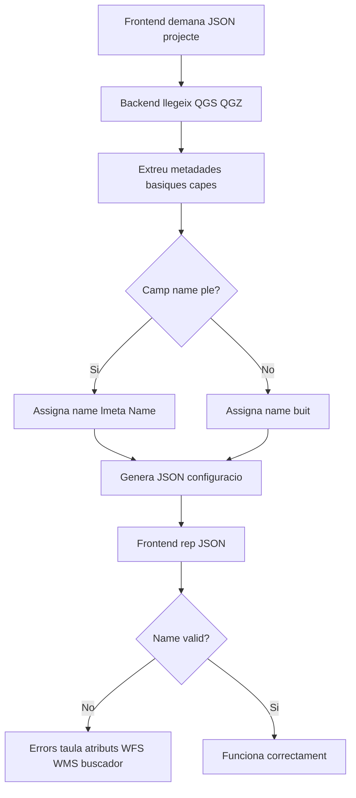
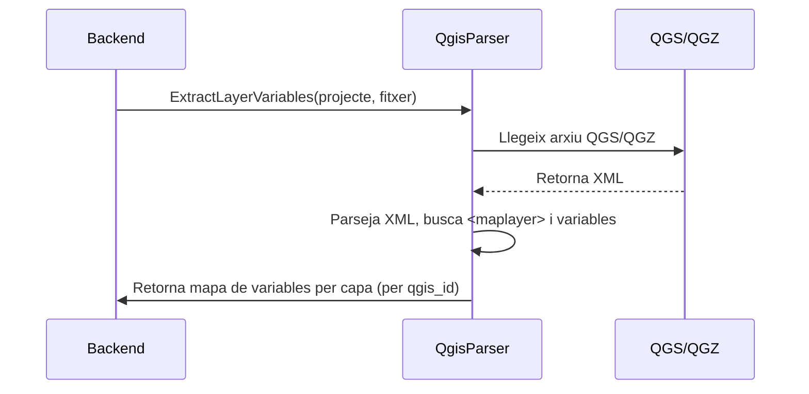

Aquí tens una proposta de documentació tècnica per adjuntar a l’informe, amb diagrames Mermaid i explicacions en català, que reflecteix clarament la complexitat, el treball realitzat i les dificultats trobades en la refactorització del parser i la gestió de noms de capa.

---

## Disseny tècnic del flux de generació de capes (abans i després)

### **Abans de la refactorització**



**Limitacions:**
- El backend no assegurava noms interns vàlids ni únics.
- No es tractaven bé casos de capes sense nom o amb noms inconsistents.
- Les variables de cerca no s’integraven de forma robusta.
- Les estructures de dades podien ser canviants i incompletes.
- Dificultats afegides per la recursivitat i l’anidament de grups/capes.

---

### **Després de la refactorització i integració del parser**

```mermaid
flowchart TD
    A[Frontend demana JSON de projecte] --> B[Backend llegeix QGS/QGZ]
    B --> C[Llama a QgisParser dedicat]
    C --> D[Extreu metadades, noms i variables de capa]
    D --> E{El camp name esta ple?}
    E -- Sí --> F[Assigna name = lmeta.Name]
    E -- No --> G[Deducció automàtica del name a partir de qgis_id (sense hash)]
    F & G --> H[Normalitza name (sense espais, guions, caracters especials)]
    H --> I[Genera JSON de configuració]
    I --> J[Frontend rep JSON]
    J --> K[Frontend utilitza name correcte per WFS/WMS i buscador]
    K --> L[Buscador i taula d'atributs funcionen OK]
```

**Millores i complexitat afegida:**
- Parser dedicat per llegir i mapar variables de capa directament del QGS/QGZ.
- Lògica per deduir el nom intern de la capa a partir del `qgis_id`, eliminant el hash final.
- Normalització de noms per garantir compatibilitat amb OGC i el frontend.
- Validació i adaptació constant per estructures de dades canviants i recursives.
- Integració robusta de variables de cerca (`qV_search`) i altres propietats específiques.
- Proves extenses en entorns remots i Windows, amb dificultats de reproducció d’errors.

---

### **Detall del parser QGIS (subprocés nou)**



---

### **Resum de dificultats i treball realitzat**

- S’ha hagut de reescriure la lògica de generació de noms interns per garantir que mai quedin buits ni siguin incorrectes.
- S’ha desenvolupat un parser específic per extreure variables de capa, adaptant-se a la manca d’estàndards i documentació.
- S’ha gestionat la recursivitat i l’anidament de grups/capes, i la variabilitat de les estructures de dades.
- S’han fet moltes proves i validacions en entorns remots i Windows, amb dificultats afegides per errors difícils de reproduir.
- S’ha invertit temps extra en garantir compatibilitat i evitar regressions, adaptant-se a múltiples versions i configuracions de QGIS.

---

**Aquestes millores han estat imprescindibles per garantir la robustesa, compatibilitat i mantenibilitat del sistema, i expliquen la desviació d’hores respecte la previsió inicial.**

Si vols afegir exemples de JSON abans/després o més detalls, només cal que ho demanis!